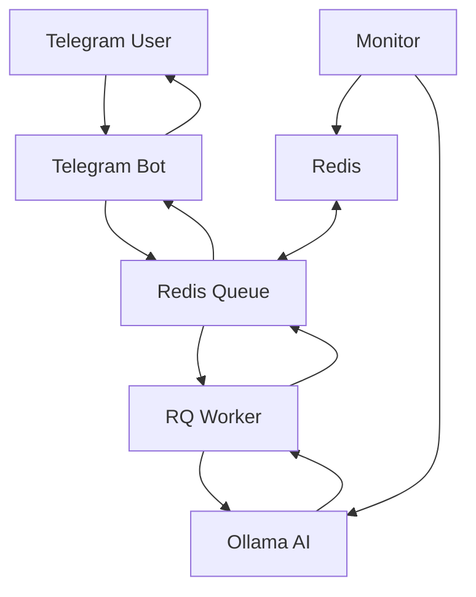

# Telegram AI Chat Bot

Advanced Telegram bot system running with Ollama AI model and Redis RQ task queue.

## 🚀 Features

- **AI Chat**: Intelligent conversation with Ollama models
- **Task Queue**: Asynchronous task management with Redis RQ
- **Docker Support**: Fully containerized installation
- **Monitoring**: System status monitoring
- **Scalable**: Horizontally scalable worker system

## 📁 Project Structure

```
telegram-ai-bot/
├── docker-compose.yml     # Docker services
├── Dockerfile             # Bot container
├── requirements.txt       # Python dependencies
├── .env                   # Environment variables
├── bot.py                 # Main Telegram bot
├── worker.py              # RQ worker
├── ai_service.py          # Ollama AI service
├── task_queue.py          # Redis RQ management
├── monitor.py             # System monitoring
├── setup.sh               # Installation script
├── logs/                  # Log files
└── README.md              # This file
```

## 🛠️ Installation

### 1. Requirements

- Docker & Docker Compose
- Telegram Bot Token

### 2. Clone the Project

```bash
git clone https://github.com/mertcan-tas/ollama-telebot.git
cd ollama-telebot
```

### 3. Set Environment Variables

Edit the `.env` file:

```env
API_TOKEN=your_telegram_bot_token_here
REDIS_HOST=localhost
REDIS_PORT=6379
REDIS_PASSWORD=your_redis_password
REDIS_DB=0
OLLAMA_HOST=localhost
OLLAMA_PORT=11434
OLLAMA_MODEL=llama3.2:1b
```

### 4. Automatic Installation

```bash
chmod +x setup.sh
./setup.sh
```

### 5. Manual Installation

```bash
# Start containers
docker-compose up -d

# Pull AI model
docker exec ollama ollama pull llama3.2:1b
```

## 📊 System Architecture



## 🎯 Usage

### Bot Commands

- `/start` - Start the bot
- `/help` - Help message
- `/stats` - Queue statistics
- `/model` - AI model information
- `/clear` - Clear completed jobs

### Chat

Send any message and wait for AI response!

## 🔧 Development

### Manual Execution

```bash
# Start Redis
docker-compose up -d redis

# Start Ollama
docker-compose up -d ollama

# Start worker
python worker.py

# Start bot
python bot.py
```

### Monitoring

```bash
# One-time status check
python monitor.py

# Continuous monitoring
python monitor.py --watch
```

### Monitoring Logs

```bash
# Bot logs
docker-compose logs -f telegram-bot

# Worker logs
docker-compose logs -f worker

# Ollama logs
docker-compose logs -f ollama

# All logs
docker-compose logs -f
```

## ⚙️ Configuration

### Changing AI Model

Change the `OLLAMA_MODEL` variable in the `.env` file:

```env
OLLAMA_MODEL=llama3:8b        # Larger model
OLLAMA_MODEL=codellama:7b     # Code-focused model
OLLAMA_MODEL=mistral:7b       # Mistral model
```

### Increasing Worker Count

Duplicate the worker service in `docker-compose.yml`:

```yaml
worker1:
  build: .
  command: python worker.py
  # ... other settings

worker2:
  build: .
  command: python worker.py
  # ... other settings
```

### Redis Settings

Optimize Redis settings for heavy usage:

```yaml
redis:
  image: redis:8.0.0
  command: redis-server --requirepass ${REDIS_PASSWORD} --maxmemory 1gb --maxmemory-policy allkeys-lru
```

## 🚨 Troubleshooting

### Bot Not Responding

1. Check container status:
   ```bash
   docker-compose ps
   ```

2. Check logs:
   ```bash
   docker-compose logs telegram-bot
   ```

3. Make sure AI model is pulled:
   ```bash
   docker exec ollama ollama list
   ```

### Worker Not Working

1. Test Redis connection:
   ```bash
   docker exec redis redis-cli -a your_password ping
   ```

2. Check worker logs:
   ```bash
   docker-compose logs worker
   ```

### Ollama Model Not Loading

1. Make sure Ollama container is running:
   ```bash
   docker-compose logs ollama
   ```

2. Manually pull the model:
   ```bash
   docker exec ollama ollama pull llama3.2:1b
   ```

### Memory Issues

Increase Docker memory limit for large models:

```yaml
ollama:
  image: ollama/ollama:latest
  deploy:
    resources:
      limits:
        memory: 4G
```

## 📈 Performance Optimization

### Redis Optimization

```yaml
redis:
  image: redis:8.0.0
  command: redis-server --requirepass ${REDIS_PASSWORD} --save 900 1 --save 300 10
```

### Ollama GPU Support

If using NVIDIA GPU:

```yaml
ollama:
  image: ollama/ollama:latest
  deploy:
    resources:
      reservations:
        devices:
          - driver: nvidia
            count: 1
            capabilities: [gpu]
```

## 🔒 Security

### Redis Security

- Use strong passwords
- Expose Redis only on local network
- Add ACL rules

### Bot Token Security

- Store token in `.env` file
- Don't add `.env` file to git
- Use environment variables in production

## 📝 API Reference

### Task Queue Functions

```python
from task_queue import enqueue_ai_request, get_job_status

# Add AI request to queue
job_id = enqueue_ai_request(user_id, message_text, system_prompt)

# Check job status
status = get_job_status(job_id)
```

### AI Service Functions

```python
from ai_service import OllamaService

ai = OllamaService()

# Is model ready?
ready = ai.ensure_model_ready()

# Generate response
response = ai.generate_response("Hello!", "You are a helpful assistant.")
```

## 🤝 Contributing

1. Fork the project
2. Create a feature branch (`git checkout -b feature/amazing-feature`)
3. Commit your changes (`git commit -m 'Add amazing feature'`)
4. Push to the branch (`git push origin feature/amazing-feature`)
5. Create a Pull Request

## 📄 License

This project is licensed under the MIT License.

**Note**: This bot is for educational purposes. Take additional security measures for production use.